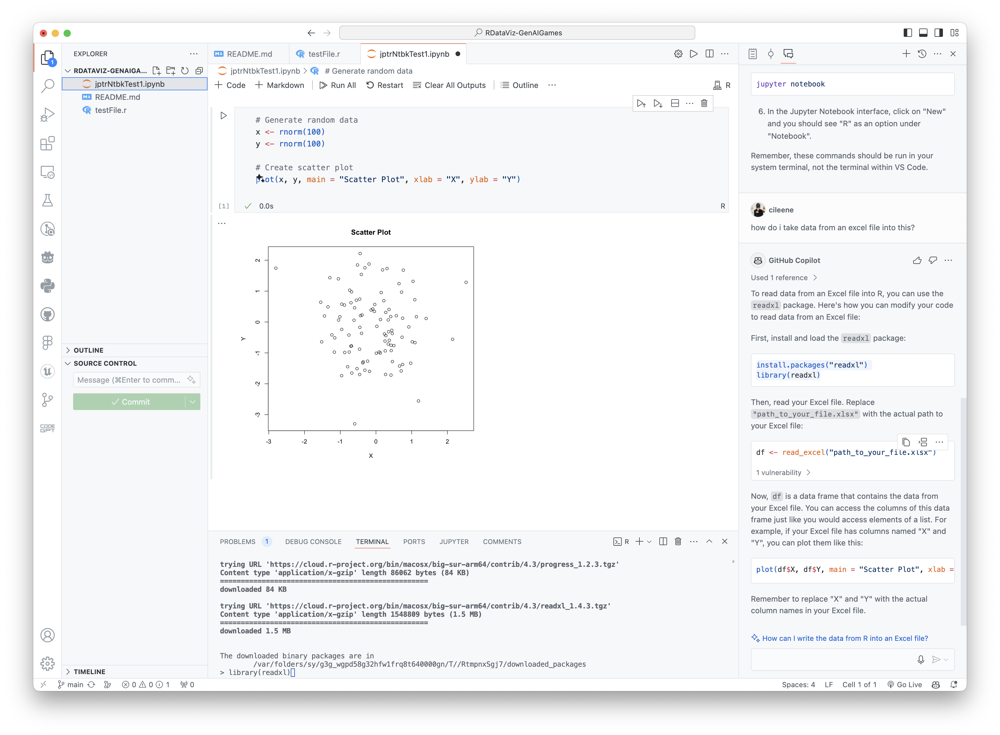
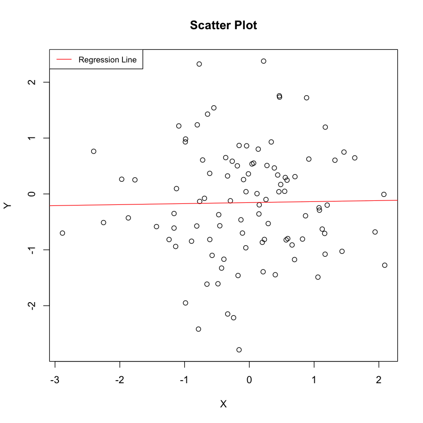
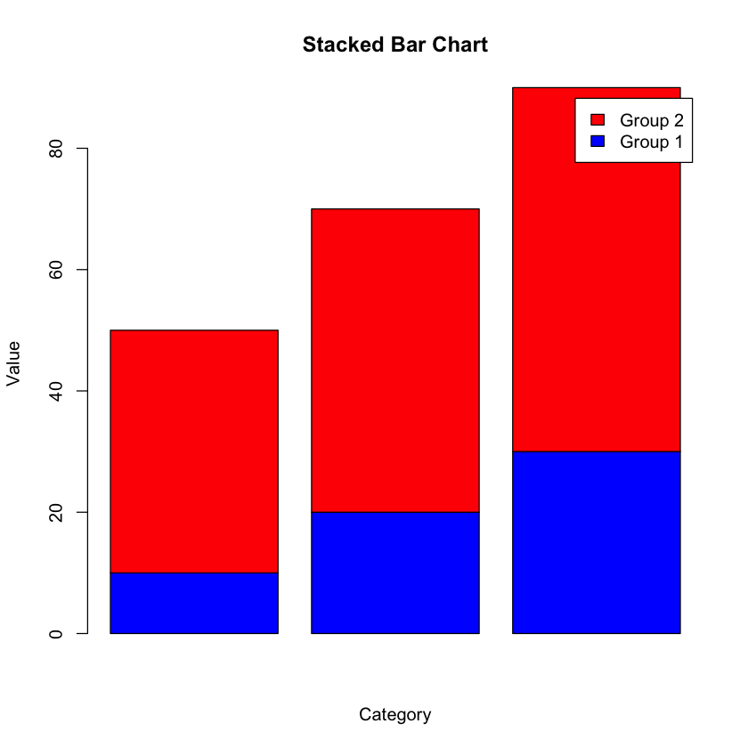

 
This is a rep dedicated to dataViz in R for the RUC 2. semester paper on the use of GenAI in the videogames industry. We will here (try) to utilize R and jupyter notebook to better understand our survey, SoMe and interview data.

steps to setup R & Jupyter Notebook in VSC

- download R from the Comprehensive R Archive Network (CRAN) at https://cran.r-project.org/.

- pip3 install jupyter

- start R in terminal by running command 'R'

- install.packages('IRkernel')
  IRkernel::installspec(user = FALSE)

- install.packages("tidyverse")

- install.packages("readxl")

- close R console 'q()' and restart

- install R extension in VSC https://marketplace.visualstudio.com/items?itemName=REditorSupport.r

- else

- ask google or chatGPT (or me)
 

